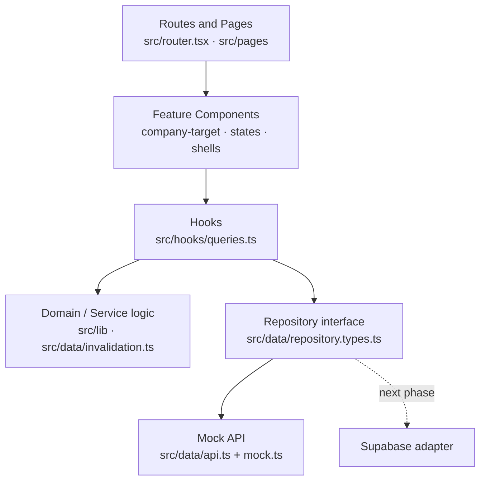

# Multi-Tenants HR

A lightweight multi-tenant HR SaaS demonstration that proves tenant isolation, company-specific packages, standard platform updates, role-based access, package diagnostics, and extensible HR modules using **one shared application**.

> **Current phase — frontend only.** This repository is a complete **frontend implementation backed by typed mock data**. There is no backend connected yet. Supabase authentication, PostgreSQL persistence, Row-Level Security (RLS), and backend authorization are **planned for the next phase and are not yet wired in**. The mock data layer is deliberately hidden behind a typed repository interface so it can be swapped for a Supabase adapter without touching the UI.

---

## Project status

| Area | Status |
|------|--------|
| Frontend foundation (Vite + React + TS) | ✅ Complete |
| Stitch "Kinetic Enterprise" UI implementation | ✅ Complete (design tokens applied across all screens) |
| Routing (public / admin / workspace) | ✅ Complete — 30 navigable routes + root redirect |
| Typed mock API + repository layer | ✅ Complete |
| Tenant-aware package gating | ✅ Complete (mock/application layer) |
| Loading / error / empty / success states | ✅ Complete (reusable state components) |
| Toast notifications (Sonner) | ✅ Complete |
| Shared company-target selection system | ✅ Complete |
| Automated tests (Vitest + RTL) | ✅ Passing — **68 tests / 11 files** |
| Supabase integration | ⛔ Not started |
| Database + RLS | ⛔ Not started |
| Production authentication | ⛔ Not started |
| Deployment | ⛔ Not started |

> **⚠️ Security disclaimer — not production-secure yet.** Tenant isolation and package entitlements are currently enforced **only in the mock application layer** (client-side gating + tenant-scoped query keys). This is sufficient for the demonstration but is **not a security boundary**. In the next phase these rules will be enforced authoritatively by **Supabase Row-Level Security and backend authorization**; the frontend checks will remain purely for UX.

---

## Technology stack

Versions reflect `package.json` (semver ranges).

| Concern | Library | Version |
|---------|---------|---------|
| UI runtime | React / React DOM | `^18.3.1` |
| Language | TypeScript | `^5.7.2` |
| Build tool / dev server | Vite | `^6.0.3` |
| Styling | Tailwind CSS | `^3.4.17` |
| UI primitives | shadcn/ui-style hand-authored components (CVA + `tailwind-merge`) | `class-variance-authority ^0.7.1`, `tailwind-merge ^2.5.5` |
| Icons | lucide-react | `^0.468.0` |
| Routing | TanStack Router | `^1.87.0` |
| Server-state / caching | TanStack Query | `^5.62.7` |
| Forms | React Hook Form | `^7.54.0` |
| Validation | Zod | `^3.24.1` |
| Toasts | Sonner | `^1.7.4` |
| Unit/component tests | Vitest | `^3.2.7` |
| Component testing | React Testing Library (`@testing-library/react`, `jest-dom`) | `^16.1.0`, `^6.6.3` |
| Test DOM | jsdom | `^25.0.1` |
| Linting | ESLint + typescript-eslint | `^9.17.0`, `^8.18.1` |

> **On "shadcn/ui":** the UI primitives follow the shadcn/ui pattern (Tailwind + CVA variants, `cn()` class merging) but are **hand-authored in `src/components/ui`** rather than generated by the shadcn CLI, and no Radix dependency is used. Overlays (popover, confirm dialog) are small custom, accessible implementations.

---

## Architecture

The app follows a strict, one-directional dependency flow so the UI never talks to a data store directly and the data provider stays replaceable:



### Why this structure exists

- **Separation of concerns** — pages render, hooks orchestrate server-state, pure modules own domain rules, the repository owns data access.
- **Testability** — domain logic (validation, query keys, invalidation, tenant/package gating, target normalization) lives in **pure, framework-free modules** that are unit-tested without React.
- **Replaceable data providers** — hooks depend on the `Repository` **interface**, not a concrete source. Swapping the mock for Supabase means implementing one interface and rebinding it in `src/data/repository.ts`.
- **Backend portability** — mutations produce a normalized payload (`toCompanyTargetPayload`) that a future backend can consume unchanged.
- **No direct data-store access from UI** — components call hooks; hooks call the repository. Nothing imports the mock store from a page.
- **Targeted caching & invalidation** — every tenant-owned query key embeds the company id; every mutation invalidates a **scoped** set of keys (never a global cache wipe).

### Layering note (accurate to the code)

There is no `services/` folder. The "service layer" responsibilities are split across dedicated, testable modules:

- **`src/hooks/queries.ts`** — the query/mutation orchestration layer (the only place that touches the repository).
- **`src/lib/`** — pure domain logic: `query-keys.ts` (key factory), `company-target.ts` & `package-target.ts` (targeting rules + schema), `tenant.ts` (portal/tenant resolution + gating), `portal-context.ts`, `query-client.ts`.
- **`src/data/invalidation.ts`** — scoped cache-invalidation rules as pure functions.
- **`src/data/repository.ts` / `repository.types.ts`** — the typed data-access boundary; `api.ts` is the current mock implementation.

---

## Getting started

### Prerequisites

- **Node.js ≥ 20** (developed on 20.20) and npm.

### Install & run

```bash
npm install
npm run dev        # start Vite dev server (http://localhost:5173)
```

### Scripts

| Script | Command | Purpose |
|--------|---------|---------|
| `npm run dev` | `vite` | Start the dev server |
| `npm run build` | `tsc -b && vite build` | Type-check all projects, then production build |
| `npm run preview` | `vite preview` | Preview the production build |
| `npm run lint` | `eslint .` | Lint the codebase |
| `npm run typecheck` | `tsc -b` | Full project type-check (no emit) |
| `npm run test` | `vitest run` | Run the test suite once |

---

## Viewing the app (portals & tenants)

There is **no real authentication yet**, so the active portal/tenant is chosen from the URL at load, and **login accepts any email + password** (the sentinel password `wrong` triggers the inline invalid-credentials state for demos).

| To view | Open | Notes |
|---------|------|-------|
| Platform Super Admin | `/login?portal=admin` (or bare `/` → redirects here) | Indigo portal, no company registration |
| Alpha Trading (HR Core **+ Leave**) | `/login?tenant=alpha` | Emerald workspace, Leave Management visible |
| Beta Manufacturing (HR Core only) | `/login?tenant=beta` | Leave Management hidden and blocked |

In production these map to hostnames (`admin.multi-tenants-hr.com`, `alpha.…`, `beta.…`); the `?portal=`/`?tenant=` query params are the **local-dev override**. Context is resolved **once at page load** and stays stable across client-side navigation, so switching portal/tenant requires editing the URL and reloading.

---

## Routes

Public:

```
/login              → reusable login (portal/tenant-aware)
/register           → company self-registration
/access-denied
/company-suspended
/                   → redirects to /login?portal=admin
```

Platform Super Admin:

```
/admin
/admin/companies
/admin/companies/:companyId
/admin/requests
/admin/requests/new
/admin/requests/:requestId
/admin/packages
/admin/packages/new
/admin/packages/:packageId
/admin/diagnostics/:diagnosticId
/admin/installations
/admin/usage
/admin/health
/admin/audit
```

Company Workspace:

```
/dashboard
/employees   /employees/new   /employees/:employeeId
/departments
/positions
/updates
/packages
/users
/settings
/leave        (gated — Alpha only)
/attendance   (gated — enabled per company)
```

The route tree is defined code-first in `src/router.tsx`. A test asserts all **30** routes are registered and that `/` redirects to `/login?portal=admin`.

---

## Multi-tenancy & package gating

- **Tenant resolution** (`src/lib/tenant.ts`, `src/lib/session.tsx`): the portal (`admin` vs `company`) and tenant id are derived from the hostname subdomain or the dev query params, resolved once and exposed via `useSession()`.
- **Package gating**: `canAccessLeave()` / `canAccessAttendance()` check a company's enabled packages. Demo rules (see `AGENTS.md`, `docs/PRD.md`):
  - **Alpha Trading** → HR Core **+ Leave Management**
  - **Beta Manufacturing** → HR Core only (Leave hidden **and** the `/leave` route renders a "package not enabled" state)
  - **Attendance Management** → releasable to all companies
- **HR Core** is always Employees, Departments, Positions.

Gating is currently client-side only — see the security disclaimer above.

---

## Data layer

- **Mock API** (`src/data/api.ts`): every read/write returns a `Promise` with **simulated latency (~500 ms)** and deep-clones results so callers can't mutate the shared store. A `forceNextFailure(key)` switch makes the next call reject with a retryable `NetworkError` (used to demo error/retry paths and in tests).
- **Repository boundary** (`src/data/repository.types.ts` + `repository.ts`): a hand-written `Repository` interface that the mock implements. Hooks import `repository`, never the mock directly, so a Supabase adapter can drop in later.
- **Mock dataset** (`src/data/mock.ts`): companies (Alpha/Beta/Gamma), employees, departments, positions, packages, requests, diagnostics, installations, usage, audit, leave, attendance.

## TanStack Query configuration

Centralized in `src/lib/query-client.ts`:

```ts
staleTime: 30_000        // 30s
gcTime: 5 * 60_000       // 5min
queries.retry: 1
refetchOnWindowFocus: false
refetchOnReconnect: true
mutations.retry: 0
```

- **Query-key factory** (`src/lib/query-keys.ts`): typed, centralized keys. **Every tenant-owned key embeds the company id** (`['employees', companyId, …]`, `['packages','company',companyId]`, …) so Alpha and Beta data can never collide in the cache. Company-target filters embed a normalized `{ targetMode, companyIds }` part (ids sorted + deduped) so logically identical selections share a cache entry.
- **Scoped invalidation** (`src/data/invalidation.ts`): pure functions returning the exact key prefixes each mutation affects (e.g. creating an employee invalidates that company's employee list + usage + audit — never another tenant). No blanket `queryClient.invalidateQueries()` anywhere. Request-status changes use an **optimistic update** with rollback.

---

## Shared UI states & notifications

Reusable, consistent state components live in `src/components/states`:

- `LoadingSkeleton` / `TableSkeleton`, `PageLoadingState`
- `EmptyState`, `NoResultsState`, `ErrorState`, `SuccessState`, `FailedState`
- `AccessDeniedState`, `CompanySuspendedState`, `PackageUnavailableState`
- `InstallationProgress` / `InstallationSuccess` / `InstallationFailure`, `RetryAction`, `ConfirmDialog`

Data tables route through `TableBoundary` (skeleton → inline error + retry → empty → no-results → data) and show a background "Refreshing…" indicator on refetch. Forms show field-level Zod errors, a disabled + spinner submit button while pending, and success/error toasts.

**Notifications** (`src/lib/notify.ts` + Sonner `<Toaster>`): centralized toast messages for record created/updated/disabled, request status changes, package assigned, update started/installed/failed, validation failure, and network failure. **Critical failures always render an inline state with a retry affordance** — toasts never stand alone for those.

## Reusable company-target selectors

`src/components/company-target` provides **one** selection system used everywhere all/selected/one-company targeting is needed (package releases, request linking, and the installation/usage/audit/diagnostic filters):

- `CompanyTargetSelector` (orchestrator), `CompanyMultiSelect`, `CompanySingleSelect`, `CompanyCombobox` (search, keyboard nav, checkboxes, select-all-visible, clear-all), `SelectedCompanyChips`, `CompanyTargetSummary`.
- Domain rules in `src/lib/company-target.ts` (types, `normalizeCompanyTarget`, `toCompanyTargetPayload`, `createCompanyTargetSchema`) and `src/lib/package-target.ts` (mode restrictions per package/extension type: private → one company, shared → selected/all).
- Accessible: radiogroup modes, `listbox`/`option` roles, `aria-activedescendant`, `aria-live` selected count, Escape-to-close with focus return, error associated via `aria-describedby`.

---

## Testing

```bash
npm run test
```

**68 tests across 11 files** currently pass. Coverage highlights:

| File | Focus |
|------|-------|
| `src/lib/tenant.test.ts` | Portal/tenant resolution + Leave/Attendance gating (Alpha vs Beta) |
| `src/lib/company-target.test.ts` | Targeting helpers + Zod schema (all/one/selected, duplicates) |
| `src/lib/package-target.test.ts` | Allowed target modes per package/extension type |
| `src/lib/query-keys.test.ts` | Tenant cache isolation + target participation in keys |
| `src/lib/portal-context.test.ts` | Login portal context (admin hides registration) |
| `src/data/invalidation.test.ts` | Scoped invalidation targets (no cross-tenant leakage) |
| `src/data/api.test.ts` | Mock latency, clone-on-read, forced-failure + retry |
| `src/router.test.ts` | Route inventory (30) + `/` → `/login?portal=admin` |
| `src/pages/login.test.tsx` | Admin vs company login rendering (registration visibility) |
| `src/components/states/states.test.tsx` | Reusable state components + retry |
| `src/components/company-target/company-target-selector.test.tsx` | Modes, search-preserves-selection, select-all-visible, clear-all, count, empty |

---

## Project structure

```
src/
  components/
    ui/                 shadcn-style primitives (button, card, input, table, badge, field, submit-button)
    states/             loading / empty / error / success / installation / confirm-dialog + retry
    company-target/     shared all/selected/one company selection system
    app-shell · admin-shell · workspace-shell · page-header · stat-card · table-boundary
  data/
    api.ts              mock Repository implementation (latency, clone, forced-failure)
    repository.ts       repository facade (current binding = mock)
    repository.types.ts typed Repository interface (the swappable boundary)
    invalidation.ts     scoped cache-invalidation rules
    mock.ts · types.ts  seed data + domain types
  hooks/
    queries.ts          query/mutation hooks (only layer that touches the repository)
    use-login-portal-context.ts
  lib/
    query-client.ts · query-keys.ts   TanStack Query config + typed key factory
    company-target.ts · package-target.ts   targeting domain + schema
    tenant.ts · session.tsx · portal-context.ts   tenancy + auth context
    notify.ts · utils.ts
  pages/
    public.tsx (login/register/access-denied/suspended)
    admin.tsx (platform super admin screens)
    workspace.tsx (company workspace screens)
  router.tsx            code-first TanStack Router tree
  main.tsx              app entry (providers + Toaster)
docs/                   PRD.md · ARCHITECTURE.md · OVERVIEW.md
AGENTS.md               product scope & rules for contributors/agents
```

---

## Local Supabase backend (in progress)

The backend is being built behind the existing repository/auth interfaces; **mock
stays the default** (`VITE_DATA_SOURCE=mock`), so the app runs with no backend.

Local dev stack (requires Docker). This project uses **non-default ports (+10)**
to coexist with other local Supabase stacks:

| Service | URL |
|---|---|
| API / Functions | http://127.0.0.1:54331 |
| Postgres | 127.0.0.1:54332 |
| Studio | http://127.0.0.1:54333 |

```bash
npx supabase start                       # boot the local stack
npx supabase db reset                    # apply migrations + HR Core seed
npx supabase functions serve register-company --no-verify-jwt
```

Applied so far: platform/tenancy foundation + auth/onboarding (companies,
memberships, platform_admins, packages, package_versions, company_packages,
company_settings, audit_logs), RLS + helper functions, the service-role-only
`onboard_company()` RPC, and the public `register-company` Edge Function
(atomic Auth-user + tenant creation with rollback). The service-role key lives
only in the Edge Function, never in the browser.

---

## Roadmap — next phase

The current mock repository is a drop-in seam for the backend. Planned next:

1. **Supabase adapter** implementing the `Repository` interface (auth, Postgres persistence).
2. **Email/password auth** replacing the mock login (no MFA / password reset / invitations — per `docs/PRD.md` non-goals).
3. **Row-Level Security + backend authorization** as the real tenant/package boundary.
4. **Subdomain-based tenant resolution** in production.
5. **Deployment** (frontend + Supabase).

Out of scope (see `docs/PRD.md` and `AGENTS.md`): payroll, recruitment, performance, billing, in-app chat, invitations, MFA/password reset, microservices.

---

## Contributing

- Read `AGENTS.md`, `docs/PRD.md`, and `docs/ARCHITECTURE.md` before making changes — they define the approved scope.
- Before opening a PR, ensure all four gates pass:
  ```bash
  npm run lint && npm run typecheck && npm run test && npm run build
  ```
- Keep the dependency flow intact: **pages → hooks → repository**. Don't import the mock store from a component, and don't hard-code tenant-specific logic in reusable components.
- Add tests for new domain logic (pure modules under `src/lib` / `src/data`) and new reusable components.
- Preserve the Kinetic Enterprise design tokens and the existing shared state/notification components.

### Environment / secrets

- `.env` is git-ignored and not required to run the frontend (no runtime env vars are consumed yet).
- MCP configs (`.mcp.json`, `.vscode/mcp.json`) reference the Stitch API key via env/prompt placeholders — no secrets are committed.

---

## License

Internal demonstration project — license to be determined.
